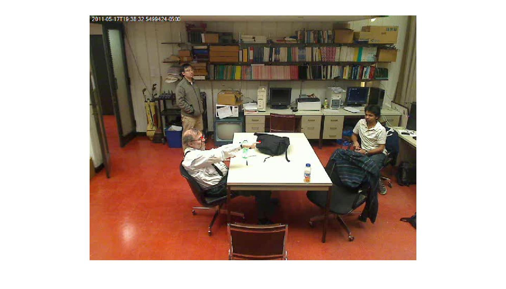
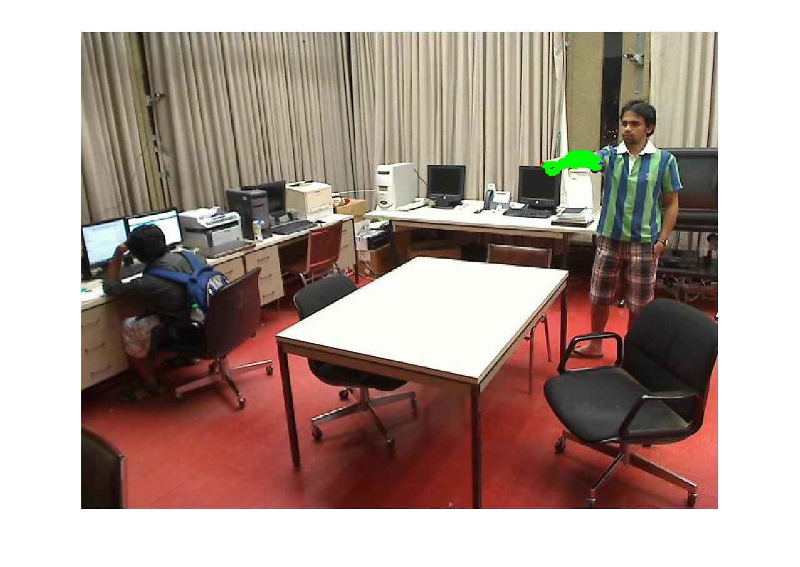
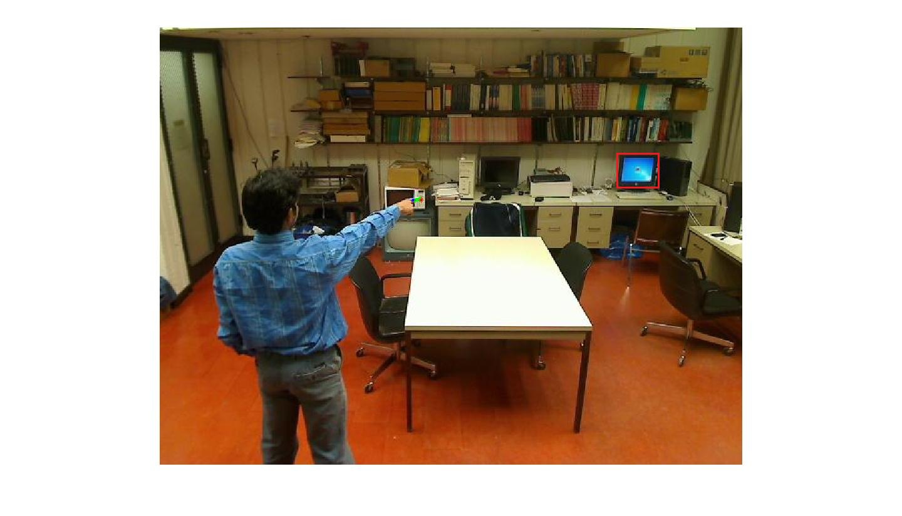
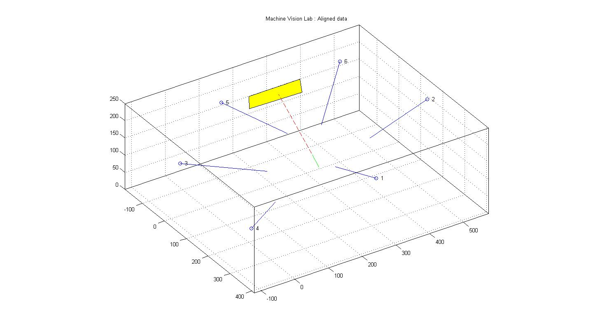
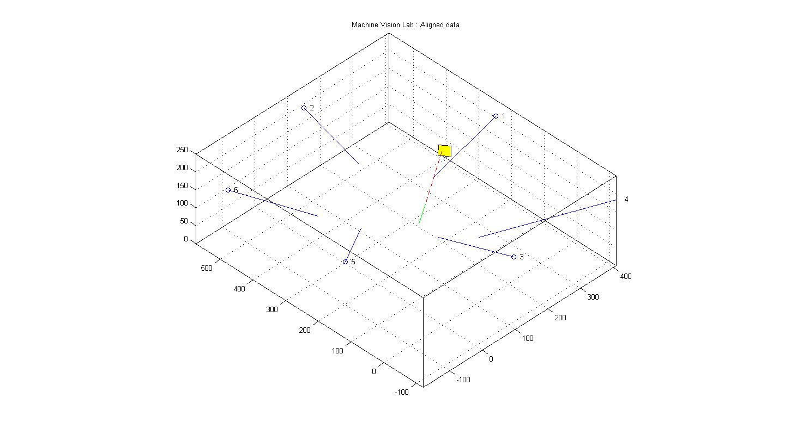

* Master's thesis defended in June 2011 at UIC College of Engineering
* Topic - An Efficient Methodology for 3D Tracking and Pointing Localization of Humans for Robotic Guidance
* [Link to thesis document](2011_Summer_ShankaranandJagadeesan.pdf)
* [Link to thesis presentation](An%20Efficient%20Methodology%20for%203D%20tracking%20and%20Pointing.pdf)
---
### Sample Images
*Head-finger pointing estimation*

*Forearm-finger pointing estimation*

*Finger-extrema pointing estimation*

*Pointing object estimation in 3D*

